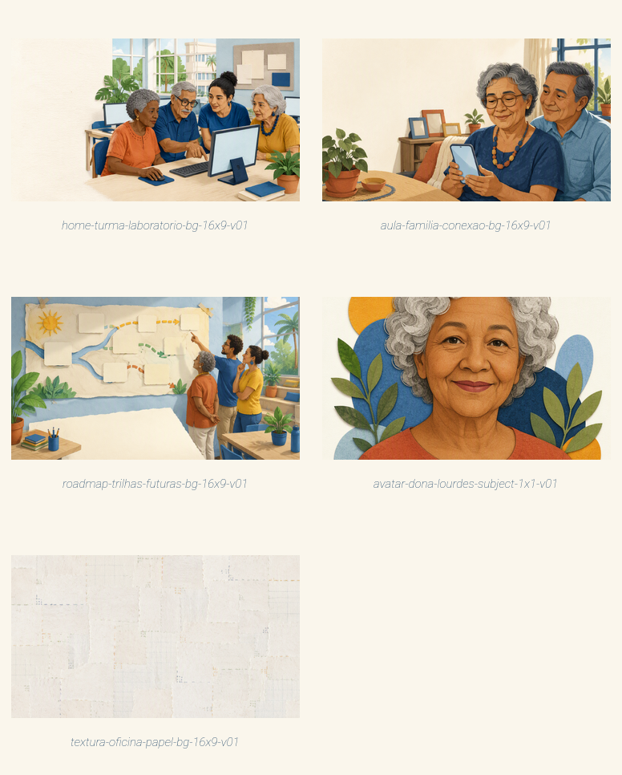

<!--
  SPEC.md - Redesign spec for the Inclusão Digital UEMG portal.
  Authoritative redesign specification. One prose spec only (this file).
  Supporting evidence: art/prompts/rebuild_2026/, art/provenance/rebuild_2026-assets.json,
  public/assets/ilustracoes/rebuild_2026/. Current product truth lives in PRODUCT.md and DESIGN.md.
  Baseline reconciled against origin/main @ 2c59781 (48 of 49 session paths already landed).
-->

# SPEC - Rebuild do Portal Inclusão Digital UEMG (Ateliê de Autonomia)

**Status:** proposta de redesenho para revisão do captain. Não altera páginas de produção.
**Baseline:** `origin/main` em `2c59781` ("feat: close user surface readiness gate").
**Idioma do produto:** português brasileiro. **Stack:** Vite 7 + HTML/CSS/JS puro, deploy Vercel.
**Fonte de intenção:** sessão Hermes `20260809_190458_3e1408` + `PRODUCT.md` + `DESIGN.md` + `SEMINARIO/DOCS`.

Este documento é a especificação única. Ele reaproveita o produto que já existe e propõe um próximo
passo coerente: substituir o mundo visual "Colcha de Retalhos" por um mundo mais digno e legível para
adultos 60+, **preservando** todo o conteúdo, rotas, acessibilidade e a autoria coletiva do programa.
Além do redesenho visual, o spec adiciona **duas superfícies novas pedidas pelo captain**: uma página de
**Roadmap das Trilhas** (as propostas reais futuras) e um **formulário de sugestão de trilha**.

---

## 0. Como ler este spec

- Seções 1-3: o problema, o que sobrevive, o que muda e por quê.
- Seções 4-6: o mundo visual, o freeze-list e a matriz superfície × papel × proporção.
- Seções 7-8: evidência gerada (contact sheet) e ponteiros de proveniência.
- Seções 9-12: inventário de páginas/estados, fronteiras código × imagem, sequência de implementação.
- Seções 13-14: critérios de aceite e não-objetivos/limites de privacidade.

Toda contagem vem do inventário real do repositório (seção 6), não de um teto arbitrário.

---

## 1. Problema do usuário e caminho de sucesso (60+)

**Quem.** Adulto brasileiro de 60 a 75+ anos, iniciante ou com pouca experiência digital, muitas vezes
com ansiedade computacional (Di Giacomo 2019). Motivação real: falar com filhos e netos, resolver
serviços essenciais (banco, saúde, Gov.br, PIX) e ganhar autonomia sem medo.

**Onde.** Laboratório de informática da UEMG Frutal, em aula presencial semanal de 2h, com duplas
colaborativas e monitores. O aluno também acessa em casa. O monitor projeta e guia; o aluno pratica na
própria tela.

**Problema.** O portal atual já virou o ambiente das aulas (bom), mas dois problemas continuam:
1. **Coesão de pré-requisitos** - termos técnicos ainda aparecem antes de serem ensinados
   (`SEMINARIO/DOCS/Coesao_Trilha_Matriz_Prerequisitos.md` documenta o padrão sistêmico: "contato",
   "conta", "senha", "app", "upload", "QR Code" usados sem definição no momento certo).
2. **Mundo visual.** O mundo "Colcha de Retalhos" (chita + costura + letra manuscrita Kalam) é caloroso,
   mas carrega dois riscos para este público: a fonte manuscrita **Kalam** em títulos reduz legibilidade
   para 60+, e a metáfora doméstica de colcha/bordado tende ao registro nostálgico-fofo, que beira a
   vitimização que a própria fundamentação acadêmica manda evitar (Schreurs 2017: nunca tratar o idoso
   como vítima passiva).

**Caminho de sucesso (o que "deu certo" para um aluno).**
1. Chega à Home e entende em um olhar: "aqui eu aprendo a usar tecnologia, no meu ritmo, com ajuda".
2. Abre a Aula 1 e a **primeira interação é trivial e garantida** (autoeficácia).
3. Percorre a aula em etapas, **uma etapa = uma tela**, sem rolar a página para achar conteúdo.
4. Cada termo novo é ensinado com analogia; reaparições viram tooltip.
5. Termina cada aula no "momento eu consigo" e sai com uma missão real (mandar mensagem, fazer um PIX).
6. Ao fim da trilha, recebe o certificado e entra na comunidade de apoio.

**Métrica de sucesso** = aluno 60+ conclui a trilha e realiza sozinho pelo menos 3 tarefas reais
(mensagem, foto, PIX/Gov.br). O redesenho não inventa números de impacto; usa apenas os já comprovados
(PAEx 2025: 20 matriculados, 16 concluintes, 80% de retenção; 16+ anos; 500+ históricos).

---

## 2. O que DEVE sobreviver (verdade do produto)

Nada abaixo pode ser removido ou alterado pelo redesenho sem autorização explícita.

### 2.1 Conteúdo e rotas
- **Rotas do shell** (Vite multipágina): `/` (`index.html`), `/aulas.html`, `/pratique.html`,
  `/comunidade.html`, `/certificado.html`.
- **Aulas interativas**: `/aulas/aula_01.html` … `/aulas/aula_09.html` (9 arquivos), com o contrato de
  `data-etapa` sequencial e as 5 fases andragógicas (`f1`…`f5`). Densidade de etapas atual:
  01=59, 02=48, 03=38, 04=62, 05=76, 06=64, 07=16, 08=16, 09=14 blocos `data-etapa`.
- **PDFs como material do monitor**: `public/aulas/aula_01.pdf`…`aula_08.pdf`, linkados de forma discreta
  sob o botão "Aula Interativa". Restrição do projeto: **nunca deletar arquivos de `AULAS/`**.
- **Player compartilhado**: `public/assets/player.css` + `public/assets/player-base.js` (navegação por
  etapas, tooltips de vocabulário, quizzes genéricos por `data-feedback`, ajuda fixa, dica condicional de
  rolagem).
- **Quiz standalone** do `pratique.html` (`#quiz-container`, dados inline) - handler próprio, não tocado
  pelo `main.js`.
- **Logos reais das ferramentas** (`public/assets/logos/`): chrome, gmail, docs, sheets, slides, drive,
  photos, whatsapp, youtube, facebook, instagram, playstore, govbr, pix. Diretriz do captain (sessão):
  logo real identifica cada ferramenta; UI é sempre HTML/CSS.
- **Fotos didáticas reais** (`public/assets/fotos/aula_XX/`) e seu `manifest.json` - já curados e
  aprovados; ver `public/assets/README.md`.
- **Documentação acadêmica** em `SEMINARIO/DOCS/` (Fundamentação, Coesão/Matriz, Wayfinder, Cronogramas,
  Especificação Completa) - fonte pedagógica; permanece intacta.

### 2.2 Acessibilidade (contrato atual, a preservar e reforçar)
- Fonte de conteúdo ≥ 18px; opções de quiz e conteúdo pedagógico ≥ 20px em desktop e mobile.
- Contraste AA+; foco visível (outline 4px); alvos de toque ≥ 44px, botões ≥ 56px.
- **Uma etapa = uma tela**: a página do player não rola; a etapa ativa ocupa o viewport.
- Contrato acessível do player: só a etapa ativa fica sem `hidden`; ao navegar, foco vai para o novo
  `h2`; termos respondem a Enter/Space/Escape; feedback de quiz em live region; "Concluir" volta ao
  catálogo.
- Menu mobile: abre com foco no primeiro item, torna o conteúdo principal `inert`, fecha com Escape e
  restaura foco no botão.
- `prefers-reduced-motion`: todas as animações colapsam para 0.01ms.

### 2.3 Atribuição institucional (autoria coletiva)
- Nome: **Programa de Inclusão Digital UEMG** (Frutal, desde 2009).
- Marcas UEMG/PAEx: `public/images/logo.png`, `public/logos/LOGOMARCA_UEMG_Horizontal.png`,
  `SEMINARIO/DOCS/LOGOS/paex-institucional.png`, manual de identidade
  (`SEMINARIO/manual_identidade_visual.html`).
- Créditos no rodapé: Myke Matos dos Santos; Prof. Cícero Marcelo de Oliveira; apoio PAEx - UEMG.
- Processo institucional citado (proposta assinada) em `.next_steps/` - referência, não conteúdo público.
- **O programa é coletivo.** Nenhuma tela pode atribuir o trabalho a uma pessoa só, nem inventar
  depoimentos ou números.

---

## 3. O que o redesenho SUBSTITUI (e por quê)

Fundamentado na sessão Hermes e no código atual. A sessão pediu explicitamente: "tornar a page o
ambiente das aulas", "conteúdo denso e real", "etapas guiadas + renderizações reais + tooltips",
"trilha coesa que ensina os pré-requisitos", "uma etapa = uma tela", "logos reais". Tudo isso **fica**.
O que muda é só o mundo visual e três decisões de legibilidade.

| Substitui | Por | Motivo (evidência) |
|---|---|---|
| Mundo **Colcha de Retalhos** (chita, costura, algodão cru) | Mundo **Ateliê de Autonomia** (papel recortado artesanal, laboratório+casa, adultos capazes) | Colcha resvala no registro nostálgico-fofo; Ateliê mantém o calor sem infantilizar (Schreurs 2017; princípio "empoderamento, nunca vitimização"). |
| Títulos em **Kalam** (manuscrita) | Títulos em fonte sem serifa de alta legibilidade (ex.: a mesma família do corpo, peso alto) | Manuscrita reduz legibilidade para 60+; a própria `DESIGN.md` admite Kalam como "personalidade do mundo", não como decisão de acessibilidade. |
| Metáfora de progresso "retalho costurado" | Metáfora de progresso "peça montada / etapa concluída" no mesmo material de papel | Preserva progresso visível e erro-sem-culpa, sem a conotação de trabalho doméstico feminino. |
| Ilustrações da série chita (idosos costurando) | Série Ateliê (idosos aprendendo no laboratório e usando tecnologia em casa) | Alinha a imagem ao que o programa realmente faz: ensinar tecnologia, não costura. |

**Não muda:** paleta institucional azul UEMG, vermelho, amarelo, verde e off-white (reaproveitados);
Open Sans no corpo; todo o comportamento do player; a estrutura de 9 aulas; o sistema de tooltips; os
mockups em código; os logos reais; as fotos didáticas.

O protótipo deletado `SEMINARIO/wireframes/prototype_botoes_aula.html` **não** é restaurado: o relatório
de recuperação confirma que foi excluído de propósito após validar a "variante A - botões nos cantos",
que já está em produção no player. Restaurá-lo reabriria uma decisão já tomada.

---

## 4. Contrato do mundo visual - "Ateliê de Autonomia"

**Uma frase.** Um mundo calmo de **papel recortado artesanal** ambientado entre o laboratório da
universidade pública e a casa do aluno, onde o adulto 60+ aparece como **protagonista capaz**, nunca como
coitado.

**Modo (Impeccable).** A Home é **Persuade** (fazer o aluno começar a Aula 1); as aulas e o player são
**Operate** (completar a tarefa sem obstáculo); os documentos são **Read**.

**Estratégia de cor: Committed.** O azul UEMG profundo âncora confiança institucional; terracota carrega
a ação; amarelo/verde pontuam estados. Fundo off-white de papel.

| Token | Valor | Papel |
|---|---|---|
| `--azul-uemg-profundo` | `#1E4466` | Âncora institucional, sidebar, rodapé, títulos escuros |
| `--azul-ceu` | `#3E6C9E` | Links, tooltips, foco |
| `--terracota` | `#B5372C` | Ação primária (botões) |
| `--terracota-escura` | `#93281F` | Hover do primário |
| `--marigold` | `#E9B44C` | Acento, etiquetas, números |
| `--verde-folha` | `#4E7D4A` | Sucesso, conclusão, "momento eu consigo" |
| `--papel` | `#FAF6EC` | Fundo (papel off-white) |
| `--papel-rebaixado` | `#F1EADA` | Superfície rebaixada, trilho de progresso |
| `--tinta` | `#3A3228` | Texto principal (tinta fosca, não cinza) |
| `--tinta-suave` | `#6B6152` | Texto secundário |

> Estes tokens reaproveitam os valores já usados em `src/style.css`/`player.css`; a mudança é de **nomes
> e narrativa**, não uma ruptura de paleta. Isso mantém o contraste AA+ já verificado e evita retrabalho.

**Tipografia.**
- Display/títulos: sem serifa de alta legibilidade e forte (ex.: peso 800 da própria família do corpo, ou
  uma grotesca legível). **Substitui Kalam.** Justificativa: legibilidade 60+ é decisão de acessibilidade,
  não estética.
- Corpo: **Open Sans** (mantido; legibilidade comprovada, decisão documentada no PRODUCT.md).
- Escala mínima de conteúdo: 18px; conteúdo pedagógico e quiz ≥ 20px.

**Materiais.** Papel recortado em camadas, tinta fosca, contorno de grafite suave, madeira clara,
textura de papel artesanal. Sombras suaves (sem brilho). Cantos levemente arredondados. Divisores como
linha de grafite tênue (substitui a costura tracejada, mais discreto e menos "temático").

**Câmera e luz (freeze).** Cena ampla ao nível dos olhos sentado; luz quente de dia claro.

---

## 5. Freeze-list (preservar entre toda a série)

Fonte autoritativa: `art/provenance/rebuild_2026-assets.json`.

- **Câmera:** nível dos olhos sentado; cenas contextuais amplas; sem plongée/contra-plongée.
- **Paleta:** azul UEMG profundo, azul-céu, terracota, marigold, verde-folha, off-white de papel.
- **Materiais:** papel recortado em camadas, tinta fosca, contorno de grafite, madeira clara, papel.
- **Luz:** dia claro e quente (meio da manhã à tarde).
- **Pessoas:** adultos brasileiros de 60-75, tons de pele e gêneros variados, roupa cotidiana digna,
  expressão atenta e capaz; monitores lidos como iguais.
- **Ambiente:** laboratório de informática da universidade pública em Frutal e a casa do aluno.
- **Linguagem de aparelho:** carcaças reais de hardware com **telas em branco** (campo geométrico pálido);
  toda UI real permanece em HTML/CSS/SVG.

Qualquer variação nova é gerada por geração direta (o helper Azure deste projeto não faz image-to-image)
e comparada lado a lado com esta lista antes de aceitar.

---

## 6. Matriz superfície × papel de asset × proporção (do inventário real)

Contagem derivada do repositório atual (`public/assets/ilustracoes/`, `public/assets/fotos/`,
`public/assets/logos/`, `public/images/`). "Regenerar" = trocar para o mundo Ateliê na implementação;
"manter" = já é código/foto/logo e não muda de papel.

| Superfície | Papel do asset | Proporção | Qtd no inventário | Tratamento no rebuild |
|---|---|---|---|---|
| Início (hero-community) | bg (cena ambiente) | 16:9 | 1 (`hero-colcha-retalhos-16x9-v01`) | **Regenerar** → `home-turma-laboratorio-bg-16x9` (evidência gerada) |
| Aulas (capa 01-09, Fase 1) | bg (cena ambiente) | 16:9 | 9 covers + 1 subject 9:16 (aula 03) | **Regenerar** a série; 1 representante gerado (`aula-familia-conexao`) prova o mundo |
| Player (simuladores) | subject (avatar) | 1:1 | 2 (`avatar-vo-dona-zilda`, `avatar-vo-seu-jose`) | **Regenerar**; 1 representante gerado (`avatar-dona-lourdes`) |
| Global (fundo de seção) | texture (bg) | 16:9 | 3 (chita floral/azul/verde) | **Regenerar**; 1 representante gerado (`textura-oficina-papel`) |
| Trilhas futuras (IA/Mercado/Palestras) | bg (cena ambiente) | 16:9 | 3 | **Regenerar quando a trilha existir**; hoje "em breve" (não bloqueia o rebuild) |
| Roadmap das Trilhas (`/trilhas.html`) | bg (cena ambiente) | 16:9 | superfície nova | **Regenerar**; 1 representante gerado (`roadmap-trilhas-futuras`) |
| Sugestão de trilha (formulário) | — (HTML/CSS) | — | superfície nova | **Sem raster**; formulário acessível em código |
| Aulas (fotos didáticas reais) | foto (reconhecimento) | 16:9 / 1:1 / 9:16 | 19 fotos aprovadas + manifest | **Manter** (já aprovadas; ver `public/assets/README.md`) |
| Ferramentas (chips) | logo real | — | 15 logos | **Manter** (logos oficiais; nunca gerados pelo modelo) |
| Comunidade | foto/ilustração | livre | `group-illustration.jpg` | **Regenerar** no mundo Ateliê (opcional; baixa prioridade) |
| Marca institucional | logo | — | UEMG/PAEx | **Manter intacto** (nunca gerado) |
| Certificado | vetor/print CSS | A4 | 0 raster de fundo | **Manter** (SVG/CSS; sem raster gerado) |

**Conjunto de evidência gerado agora = 5 assets selecionados**, cobrindo cada papel raster distinto do
inventário (bg de hero, bg de capa de aula, bg de roadmap, subject/avatar, texture/bg). Este é o mínimo que
prova o mundo em todos os papéis raster **sem** regenerar 20+ arquivos antes da aprovação do captain. A série
completa por aula/trilha é regenerada na fase de implementação (seção 11), reusando o freeze-list.

---

## 7. Evidência gerada (contact sheet)

Folha de contato dos 4 assets selecionados (rótulos por papel):

Visões individuais:

| Papel | Arquivo | Proporção |
|---|---|---|
| Home bg | `public/assets/ilustracoes/rebuild_2026/home-turma-laboratorio-bg-16x9-v01.png` | 1536×864 |
| Aula bg (Fase 1) | `public/assets/ilustracoes/rebuild_2026/aula-familia-conexao-bg-16x9-v01.png` | 1536×864 |
| Roadmap bg | `public/assets/ilustracoes/rebuild_2026/roadmap-trilhas-futuras-bg-16x9-v01.png` | 1536×864 |
| Player subject | `public/assets/ilustracoes/rebuild_2026/avatar-dona-lourdes-subject-1x1-v01.png` | 1024×1024 |
| Global texture | `public/assets/ilustracoes/rebuild_2026/textura-oficina-papel-bg-16x9-v01.png` | 1536×864 |

Rascunho rejeitado (exploração de composição do hero): `art/rejeitados/rebuild_2026/home-turma-laboratorio-bg-16x9-draft-v01.png`.

**Read-back verification (feita antes de reabrir cada prompt):** todos os 5 passaram em mundo, paleta,
composição, campo livre para copy, telas em branco, anatomia de mãos e ausência de texto/logo/marca.
Comparados lado a lado, compartilham material, paleta, luz e dignidade - mundo consistente.

---

## 8. Prompts e proveniência (ponteiros exatos)

- **Prompts reproduzíveis:** `art/prompts/rebuild_2026/` (um `.txt` por asset, com cabeçalho
  `surface/role/ratio/quality/model/world`).
- **Ledger legível por máquina:** `art/provenance/rebuild_2026-assets.json` - contém para cada artefato:
  arquivo, superfície, papel, proporção, dimensões, SHA-256 (16), qualidade, prompt, disposição
  (selected/rejected-draft), derivação e resultado do read-back.
- **Receipt de infraestrutura (medido nesta tarefa):** neste deployment Azure `gpt-image-2`,
  `quality=low` completou sempre; `quality=medium/high` falhou em toda tentativa por erro de rede
  (timeout de transporte), mesmo com o endpoint raiz respondendo HTTP 200. Por isso os assets
  selecionados foram gerados em `low` (saída ainda limpa e revisável). Finais de produção podem ser
  re-renderizados em qualidade maior quando o deployment aceitar renders maiores. Registrado no ledger.
- **Regra de sobrescrita:** nomeação versionada `-vNN`; nada sobrescreve asset anterior em silêncio.

---

## 9. Inventário de páginas e fluxos (ordem de leitura, estados, teclado, mobile, motion)

### 9.1 Início (`/`)
- **Ordem de leitura:** hero (promessa + botão "Começar a Aula 1") → cena Ateliê + "Ninguém aprende
  sozinho" → faixa de resultados (16+, 500+, 80%, 100% gratuito) → "O que você vai aprender" (6 cards) →
  aula mais recente → acesso rápido (Pratique, Comunidade) → rodapé institucional.
- **Estados:** links de navegação com `active`; hover/foco visível.
- **Mobile (≤768px):** sidebar off-canvas + header com hambúrguer; hero empilha; grids reduzem colunas.
- **Teclado:** ordem natural do DOM; foco visível; menu mobile com Escape e restauração de foco.
- **Reduced motion:** sem parallax; transições colapsam.
- **Copy-safe:** hero usa o terço esquerdo livre da cena Ateliê para o texto (a imagem foi composta assim).

### 9.2 Aulas (`/aulas.html`)
- **Ordem:** título → trilha de 9 cards (`.aula-item`): capa 16:9, número, título, tópicos em pills,
  ação "Aula Interativa" + link PDF discreto.
- **Estados:** aula 03 marcada "NOVA" (piloto); 09 em verde (celebração).
- **Mobile:** card colapsa para 1 coluna; capa no topo.

### 9.3 Player de aula (`/aulas/aula_0X.html`)
- **Contrato "uma etapa = uma tela":** `body { height:100dvh; overflow:hidden }`; a etapa ativa ocupa o
  viewport; overflow interno só como fallback, com dica condicional "Role para continuar".
- **Ordem de leitura por etapa:** badge de fase (f1-f5) → `h2` → conteúdo (texto à esquerda / visual à
  direita em `.etapa-grid`) → interação (mockup/quiz) quando houver.
- **Navegação:** botões nos cantos (variante A validada) - Anterior (azul) / Próximo (terracota),
  círculos de 58px, rótulos em hover/foco (persistentes em touch), `aria-label`, zona segura inferior.
  Última etapa troca a seta por ✓ e "Concluir".
- **Teclado:** ←/→ navegam quando o foco não está em campo/controle; foco vai ao novo `h2` a cada etapa.
- **Tooltips de vocabulário:** primeiro uso = lição; reuso = tooltip (hover + toque; Enter/Space/Escape).
- **Quiz:** feedback por live region; erro explica o que fazer, nunca julga.
- **Ajuda:** botão fixo "Preciso de ajuda" sempre visível.
- **Mobile (≤900px):** `.etapa-grid` colapsa para 1 coluna, visual no topo (`order:-1`); nunca rola a
  página para ver conteúdo.
- **Reduced motion:** animações de etapa e "costura/montagem" colapsam.
- **Estados de erro/vazio:** quiz sem resposta selecionada = neutro; etapa sem visual usa 1 coluna;
  imagem ausente degrada para o texto (sem quebrar layout).

### 9.4 Pratique (`/pratique.html`)
- Seletor de tema (8 aulas + Segurança) → quiz com progresso (live region) → card de conclusão.
- Sistema próprio (`#quiz-container`), não tocado pelo redesenho além de tokens visuais.

### 9.5 Comunidade (`/comunidade.html`)
- Card do grupo de WhatsApp (com aviso claro: "link ainda não configurado" - **não inventar link**) →
  links úteis (logos reais) → rodapé.

### 9.6 Certificado (`/certificado.html`)
- Ferramenta A4 standalone, sem shell do portal. Preview atualiza ao digitar; ação única "Imprimir".
- **Conteúdo factual (nome, data, carga horária, marcas) permanece HTML/CSS** - nunca raster gerado.

### 9.7 Roadmap das Trilhas (`/trilhas.html`) - superfície nova

**Objetivo.** Mostrar, de forma honesta, as trilhas do programa como **propostas reais futuras** -
o que já existe, o que está em planejamento e o que é formato aberto. Aterrado em
`.next_steps/trilhas_programa_inclusao_digital.html` (documento de trabalho, Março 2026). **Nada é
inventado**; nada é anunciado como lançado antes de existir.

**Conteúdo (as 4 trilhas), com rótulo de status claro:**

| # | Trilha | Status (rótulo honesto) | Público | Formato | Conteúdo |
|---|---|---|---|---|---|
| 1 | **Inclusão Digital 60+** | `Ativa` (9 aulas prontas) | 50+/terceira idade + comunidade | Semanal presencial ~2h | Âncora operacional; 16 anos de execução; 80% retenção PAEx 2025 |
| 2 | **Inteligência Artificial para Todos** | `Em planejamento` (8 módulos propostos) | Comunidade geral, todas as idades | Semanal ou intensivo ~2h | Devolver tempo e ampliar capacidade humana; ferramentas atuais (Claude, ChatGPT, Gemini, Perplexity, NotebookLM, Lovable, Bolt, Gamma) |
| 3 | **Tecnologia e Mercado de Trabalho** | `Em planejamento` (8 módulos propostos) | Jovens e adultos, alunos UEMG + comunidade | Semanal ou workshop ~2h | GitHub Student Pack, portfólio, LinkedIn, Copilot, freelance, empreendedorismo; projeto de marca pessoal |
| 4 | **Palestras e Cursos com Convidados** | `Formato aberto` (sob demanda) | Comunidade acadêmica e externa | 1-4h por evento, presencial/híbrido | Convidados externos; temas como cibersegurança, IA generativa, carreira em tech, dados abertos, acessibilidade |

- **Visão integrada (do documento):** entrada mínima = 1 trilha + palestras; ideal = 2 trilhas + palestras;
  completo = 4 trilhas. Base institucional: Bolsa PAEx (R$ 850/mês), Resolução CONUN 625/2024 (colaboradores
  externos), Resolução COEPE 287/2021 (extensão curricular). Processo SEI 2350.01.0000627/2025-48;
  Registro SIGA 24535/2025.
- **Ordem de leitura:** cabeçalho ("Para onde o programa vai") + cena Ateliê do roadmap → as 4 trilhas em
  cards, cada uma com rótulo de status, público, formato e resumo de módulos → visão integrada → chamada
  para o formulário de sugestão (9.8) → rodapé institucional.
- **Estados:** cada card de trilha exibe um **selo de status** (Ativa = verde; Em planejamento = azul;
  Formato aberto = marigold). A trilha 1 linka para `/aulas.html`; as demais linkam para o formulário de
  sugestão e/ou uma nota "quer ajudar a construir esta trilha?".
- **Mobile:** cards empilham em 1 coluna; módulos viram divulgação progressiva (resumo visível, detalhes
  em `
`/acordeão acessível), sem esconder funcionalidade.
- **Teclado/foco:** ordem natural; selos de status com texto (não só cor); acordeões com `aria-expanded`.
- **Reduced motion:** revelações colapsam.
- **Estados de erro/vazio:** trilhas em planejamento **não** expõem botão "começar"; expõem "em planejamento"
  + convite a sugerir/participar. Nunca prometer data que não existe.
- **Navegação do shell:** adicionar "Trilhas" à sidebar e ao rodapé (5ª entrada), substituindo o texto solto
  "IA · Mercado · Palestras - em breve" por um link real para o roadmap.
- **Imagem:** hero da página usa `roadmap-trilhas-futuras-bg-16x9-v01` (campo livre embaixo à esquerda para
  o título). Os cards de trilha reusam as capas do mundo Ateliê quando existirem; enquanto não existem, um
  bloco de cor sólida do mundo com ícone SVG.

### 9.8 Formulário de sugestão de trilha - superfície nova

**Objetivo.** Deixar aluno, monitor, professor ou pessoa da comunidade **sugerir uma trilha nova ou um
tema de palestra**. Reflete a filosofia colaborativa do documento ("os conteúdos produzidos por cada
unidade alimentam todas as outras").

**Campos (todos com `<label>` visível; placeholder nunca substitui rótulo):**
1. Nome (opcional).
2. E-mail para retorno (opcional; `type=email`, `autocomplete=email`).
3. Quem é você (select: aluno / monitor / professor / comunidade).
4. Trilha ou tema sugerido (obrigatório; input curto).
5. Por que isso importa e quem se beneficia (textarea).
6. Consentimento LGPD (checkbox obrigatório): "Autorizo o uso desta sugestão pelo programa para
   planejar trilhas futuras."

**Comportamento e acessibilidade.**
- Fonte ≥ 18px; alvos ≥ 44px; foco visível; um passo por vez, sem obstrução.
- Submit **permanece habilitado**; validar no submit, marcar campo inválido com `aria-invalid` +
  `aria-describedby` para o erro inline, e mover foco ao primeiro inválido.
- Sucesso anunciado em live region (`role=status`): "Sua sugestão foi enviada. Obrigado por ajudar a
  construir o programa."
- Erro sem culpa; linguagem clara em português; sem jargão.
- Reduced motion respeitado.

**Destino do envio (DECISÃO EM ABERTO - o projeto é estático, Vite/Vercel, sem backend hoje).**
Opções, da mais simples à mais completa:
- (A) **Endpoint de serviço de formulário** (ex.: Formspree/Getform) via POST - mantém o site 100%
  estático. **Recomendado** para o primeiro corte.
- (B) `mailto:` para a coordenação - zero dependência, mas UX ruim para 60+ (abre cliente de e-mail).
- (C) Função serverless na Vercel + armazenamento - amplia escopo (backend); requer aprovação do captain.

O SPEC recomenda (A) com aprimoramento progressivo, mas o **destino e o operador de dados** são uma
decisão do captain (ver privacidade na seção 14). Sem essa decisão, o formulário é implementado com um
`action` configurável e uma nota visível enquanto o destino não está ligado (mesmo padrão honesto do link
de comunidade: "ainda não configurado").

---

## 10. Fronteiras de componente e conteúdo (código × imagem)

**Permanece HTML/CSS/SVG (nunca raster gerado pelo modelo):**
- Toda UI de simulador (WhatsApp, Gmail, PIX, Play Store, Gov.br): telas, botões, bolhas, agenda.
- Texto, rótulos, números, dados, tabelas, fórmulas.
- Certificado (nome, data, carga, assinaturas, marcas).
- Logos e marcas institucionais (UEMG/PAEx) e logos de ferramentas.
- Barra de progresso, badges de fase, tooltips, chips `.ferramenta`.
- Ícones de interface (SVG inline já existentes na sidebar/cards).
- **Roadmap das Trilhas:** nomes, módulos, status, datas e base institucional são **texto factual** -
  sempre HTML/CSS, nunca raster gerado. Só a cena ambiente do roadmap é imagem.
- **Formulário de sugestão:** todo o formulário (campos, rótulos, erros, consentimento) é HTML/CSS.

**Pode ser imagem gerada (mundo Ateliê):**
- Cenas ambiente (hero, capa de aula na Fase 1).
- Sujeitos/avatares inventados para simuladores.
- Texturas de fundo de seção.
- Carcaças de aparelho com **tela em branco** (a tela recebe UI em código).

**Fotos didáticas reais** (reconhecimento de objeto físico: computador, roteador, QR impresso) já
existem e permanecem; a imagem ensina aparência, e rótulos/setas ficam em HTML por cima.

---

## 11. Sequência de implementação (executável sem voltar ao transcript Hermes)

Ordem em camadas (grow-in-layers). Cada fase é verificável e não quebra a anterior.

1. **Tokens e tipografia (base).** Em `src/style.css` e `public/assets/player.css`: renomear tokens para
   o vocabulário Ateliê (valores preservados), trocar a família de display de Kalam para a sem serifa
   de alta legibilidade, remover o `link` do Kalam do `<head>` das 5 páginas de shell e das 9 aulas.
   Verificar contraste AA+ e piso de 18/20px.
2. **Materiais/divisores.** Substituir a costura tracejada por linha de grafite tênue nos divisores e
   molduras; manter cantos e sombras. Sem mudar comportamento.
3. **Hero da Home.** Trocar `hero-colcha-retalhos-16x9-v01` pelo `home-turma-laboratorio-bg-16x9`
   (mover de `rebuild_2026/` para o slot de produção com `-v01`), aproveitando o terço esquerdo livre
   para o texto do hero. Ajustar `alt` descritivo.
4. **Capas de aula.** Regenerar as 9 capas no mundo Ateliê (reusando o freeze-list), começando pelas
   aulas de comunicação (03/04) e a 01. `aula-familia-conexao` já cobre o padrão.
5. **Avatares de simulador.** Regenerar `dona-zilda`/`seu-jose` no mundo Ateliê (base:
   `avatar-dona-lourdes`), preservando os nomes usados nos mockups da aula 03.
6. **Texturas de seção.** Trocar as texturas de chita por `textura-oficina-papel` onde há fundo de seção.
7. **Metáfora de progresso.** Renomear "retalho costurado" para "etapa concluída / peça montada" no
   `.momento` e legendas, mantendo o mecanismo (progresso visível, erro-sem-culpa).
8. **Roadmap das Trilhas (`/trilhas.html`).** Nova página no shell (mesma sidebar/rodapé), com as 4
   trilhas do documento `.next_steps/`, selos de status, visão integrada e hero
   `roadmap-trilhas-futuras-bg-16x9`. Adicionar "Trilhas" à navegação e trocar o texto "em breve" por
   link real. Registrar a rota no `vite.config.js` (multipágina).
9. **Formulário de sugestão de trilha.** Seção acessível no fim do roadmap (ou página própria), com o
   `action` configurável; enquanto o destino não é decidido (seção 9.8), mostra a nota honesta "ainda não
   configurado". Validar consentimento LGPD e mensagens de erro/sucesso em live region.
10. **Coesão de vocabulário (reforço).** Passar a matriz de `Coesao_Trilha_Matriz_Prerequisitos.md`:
    garantir que todo termo de nível 1-6 tem lição na primeira aparição e tooltip nas seguintes.
11. **DESIGN.md.** Reescrever `DESIGN.md` a partir do mundo construído (documentação vem depois do build).
12. **Validação.** `npm run build`, `git diff --check`, revisão visual desktop+mobile, teclado, foco,
    contraste, text scaling, reduced motion.

Cada fase mantém rotas, contrato do player e acessibilidade. As fotos didáticas reais e os logos não são
tocados.

---

## 12. Assets a substituir por material real (lista de troca)

Os assets gerados são **ilustração sintética** para revisão. Antes de produção:
- Confirmar com o captain o mundo Ateliê vs. manter Colcha.
- Regenerar a série completa (9 capas, 2+ avatares, texturas) no freeze-list, em qualidade de produção
  quando o deployment Azure aceitar renders `high` (ou por caminho de fila/retry).
- Manter fotos didáticas reais e logos oficiais como estão.

---

## 13. Critérios de aceite

### 13.1 Código
- [ ] `npm run build` passa sem erro.
- [ ] `git diff --check` limpo (sem whitespace quebrado).
- [ ] Sem framework novo; HTML/CSS/JS puro (restrição do projeto).
- [ ] Nenhuma rota removida; 9 aulas + 5 páginas de shell continuam servindo 200.
- [ ] Kalam removido dos `<head>`; nenhuma referência morta a assets antigos.

### 13.2 Acessibilidade
- [ ] Conteúdo ≥ 18px; pedagógico/quiz ≥ 20px.
- [ ] Contraste AA+ em todos os pares texto/fundo do mundo Ateliê.
- [ ] Foco visível (≥ 4px) em todos os controles; ordem de tab natural.
- [ ] Player: só a etapa ativa sem `hidden`; foco no `h2` a cada etapa; ←/→ e Escape corretos.
- [ ] Menu mobile: foco no primeiro item, conteúdo `inert`, Escape fecha e restaura foco.
- [ ] `prefers-reduced-motion`: animações colapsam.
- [ ] Alvos de toque ≥ 44px; botões ≥ 56px.

### 13.3 Responsivo
- [ ] "Uma etapa = uma tela" mantido em 1366×768 e 375×667 (sem rolar a página no player).
- [ ] Home/Aulas/Pratique/Comunidade reflow em 320px sem scroll horizontal.
- [ ] `.etapa-grid` colapsa para 1 coluna no mobile com visual no topo.

### 13.4 Consistência visual (assets gerados)
- [ ] Todo asset gerado segue o freeze-list (câmera, paleta, material, luz, pessoas, ambiente).
- [ ] Nenhum asset gerado contém texto, número, logo, marca, dado, QR ou UII.
- [ ] Telas de aparelho em branco; UI real só em código.
- [ ] Nomeação `<surface>-<subject>-<role>-<ratio>-vNN`; nada sobrescreve em silêncio.
- [ ] Cada asset tem prompt em `art/prompts/` e entrada no ledger de proveniência.

### 13.5 Conclusão de tarefa real (aluno)
- [ ] Aluno 60+ inicia a Aula 1 e completa a primeira interação trivial sem ajuda.
- [ ] Percorre uma aula inteira sem rolar a página para achar conteúdo.
- [ ] Termos novos são ensinados antes de usados (checagem da matriz de coesão).
- [ ] Chega ao "momento eu consigo" e ao certificado.

### 13.6 Roadmap das Trilhas
- [ ] `/trilhas.html` serve 200 e aparece na navegação (sidebar + rodapé).
- [ ] As 4 trilhas refletem `.next_steps/trilhas_programa_inclusao_digital.html` sem invenção.
- [ ] Selos de status usam texto + cor (nunca só cor); trilhas em planejamento não expõem "começar".
- [ ] Módulos usam divulgação progressiva acessível no mobile (`aria-expanded`).

### 13.7 Formulário de sugestão
- [ ] Todo campo tem `<label>` visível; consentimento LGPD obrigatório.
- [ ] Submit permanece habilitado; erro com `aria-invalid` + `aria-describedby`; foco no 1º inválido.
- [ ] Sucesso/erro anunciados em live region; sem placeholder-como-rótulo.
- [ ] Destino de envio decidido pelo captain (A/B/C da seção 9.8); enquanto não, nota honesta visível.

---

## 14. Não-objetivos, privacidade e limites de reivindicação

**Não-objetivos.**
- Não trocar a stack (sem React/Vue/Angular) nem adicionar componentes UI complexos sem confirmação.
- Não deletar PDFs de `AULAS/`.
- Não restaurar o protótipo deletado `prototype_botoes_aula.html` (decisão já superada).
- Não reescrever o conteúdo pedagógico das aulas (só o mundo visual e a legibilidade).
- Não criar uma segunda especificação em prosa (este `SPEC.md` é a única).
- Não adicionar backend próprio para o formulário sem aprovação (opção C da seção 9.8); o corte inicial
  usa endpoint de serviço estático ou nota honesta.
- Não anunciar trilha futura como lançada nem prometer data de início não confirmada.

**Privacidade e segurança.**
- Nenhuma credencial, chave ou payload da sessão Hermes entra no Git.
- Nenhuma foto ou rosto de aluno/monitor/coordenador real; sujeitos gerados são composições inventadas.
- Sem PII legível em imagens (documentos e telas ficam em branco/genéricos).
- **Formulário de sugestão (LGPD):** coletar o mínimo (sugestão é obrigatória; nome/e-mail opcionais);
  finalidade explícita e consentimento no envio; sem dado sensível; retenção limitada ao planejamento das
  trilhas; informar o operador de dados (coordenação UEMG/PAEx). O destino do envio (seção 9.8) define o
  operador; a decisão do captain deve considerar onde os dados ficam.

**Autoria coletiva.**
- O programa é coletivo (PAEx/UEMG Frutal). Nenhuma tela atribui o trabalho a uma pessoa só.
- Créditos existentes (Myke, Prof. Cícero, PAEx) preservados no rodapé.

**Reivindicações que o projeto NÃO pode fazer.**
- Não inventar depoimentos de alunos nem números de impacto além dos comprovados
  (PAEx 2025: 20/16/80%; 16+ anos; 500+ históricos).
- Não afirmar certificação nacional, parceria ou resultado não documentado.
- Não usar screenshots reais de apps (exigiria login); interfaces são sempre mockups em código.
- Não prometer um link de comunidade que ainda não existe (a tela avisa "ainda não configurado").

---

## Anexo A - Ponteiros de evidência

- Baseline: `origin/main` @ `2c59781`; relatório de recuperação:
  `/home/shiv/tec-workspace/data/inclusao-hermes-branch-recovery/report.md`.
- Intenção da sessão: Hermes `20260809_190458_3e1408` (mensagens de usuário 3503, 3537, 3584, 3615, 3629,
  4200, 4314, 4726, 4763 confirmam: ambiente de aulas, densidade, coesão, uma-etapa-uma-tela, logos reais).
- Produto/design atuais: `PRODUCT.md`, `DESIGN.md`.
- Propostas reais das trilhas: `.next_steps/trilhas_programa_inclusao_digital.html` (documento de trabalho,
  Março 2026); Processo SEI 2350.01.0000627/2025-48; Registro SIGA 24535/2025.
- Pedagogia: `SEMINARIO/DOCS/Fundamentacao_Academica_Aulas_Interativas.md`,
  `SEMINARIO/DOCS/Coesao_Trilha_Matriz_Prerequisitos.md`, `SEMINARIO/DOCS/Wayfinder_Mapa_Conversao_Aulas.md`.
- Assets gerados: `public/assets/ilustracoes/rebuild_2026/`, prompts `art/prompts/rebuild_2026/`,
  ledger `art/provenance/rebuild_2026-assets.json`, rascunho rejeitado `art/rejeitados/rebuild_2026/`.
